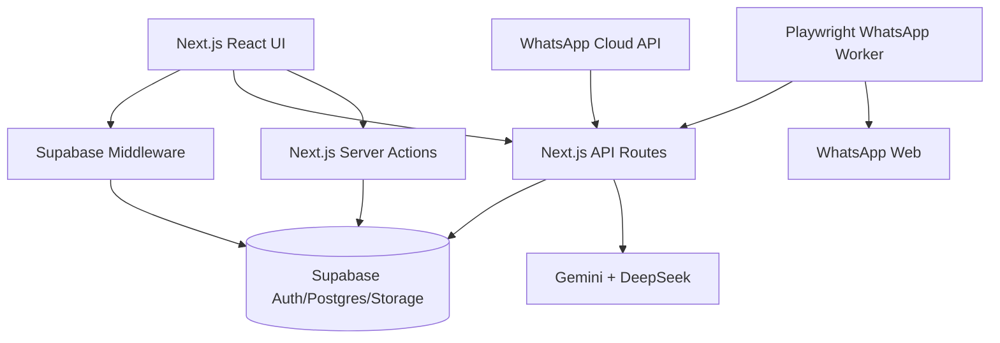

# KITCHEN-PANTRY-ERP
## Current Project Audit

**Audit type:** Read-only technical audit
**Audit date:** 2026-09-05
**Repository:** `kitchen-pantry-erp`

No source code, configuration, database schema, packages, or environment values were changed during the audit.

## 1. Executive Summary

Kitchen Pantry ERP is a Next.js/Supabase kitchen business ERP with customer, project, quotation, payment, inventory, internal messaging, WhatsApp AI, and worker functionality.

The project is functional but has several important maturity gaps:

- The working tree contains uncommitted call-feature changes.
- Several legacy routes query tables or columns that do not match the current database schema.
- Some service-role server actions lack consistent authentication and authorization checks.
- Several business/media storage buckets are public.
- WhatsApp message automation is mature, but live WhatsApp call audio capture is not available.
- Staff scheduling contains hardcoded demo data.
- There is no dedicated customer `orders` table.
- Tests focus strongly on WhatsApp logic but have limited RLS, security, UI, browser, and database integration coverage.

Overall maturity: **approximately 6/10**.

## 2. Project Architecture



Main areas:

- Frontend pages: `src/app/`
- Reusable UI: `src/components/`
- API routes: `src/app/api/`
- Server actions and services: `src/lib/`
- WhatsApp worker: `scripts/whatsapp-worker.mjs`
- Database migrations: `supabase/migrations/`
- Tests: `tests/`
- Runtime worker state: `storage/`
- Configuration: `package.json`, `next.config.ts`, `tsconfig.json`

## 3. Technology Stack

| Area | Current implementation |
|---|---|
| Framework | Next.js `16.2.12` App Router |
| React | `19.2.4` |
| TypeScript | `^5` |
| Styling | Tailwind CSS `^4`, Radix/shadcn-style components |
| State | Zustand `^5.0.14` |
| Animation | Framer Motion `^12.43.0` |
| Database | Supabase PostgreSQL |
| Authentication | Supabase Auth with SSR cookies |
| Storage | Supabase Storage |
| AI | Google Gemini primary, DeepSeek fallback |
| Browser automation | Playwright `^1.62.1` |
| WhatsApp | Custom Playwright worker plus optional WhatsApp Cloud API |
| Validation | Zod |
| Testing | Vitest |
| Deployment | Local scripts only; no Docker, PM2, or CI configuration found |

`OPENAI_API_KEY` is documented in `.env.example`, but the active AI provider implementation uses Gemini and DeepSeek.

## 4. Current Features

| Feature | Status | Evidence |
|---|---|---|
| Authentication | Implemented | Supabase Auth, middleware, profiles, login actions |
| Role dashboards | Implemented | Admin, staff, customer, contractor routes |
| Customers | Implemented | Customer creation, editing, profile, projects and payments |
| Projects | Implemented | Project lifecycle, assignments, measurements |
| Estimates | Implemented | Estimate builder and estimate tables |
| Quotations | Implemented/Partial | Quotation workflows and PDF support; legacy mismatches remain |
| Payments | Implemented/Partial | Customer/contractor payments; schema/action inconsistencies remain |
| Inventory | Implemented/Partial | Materials, stock transactions, suppliers, low-stock alerts |
| Purchase orders | Implemented/Partial | Purchase order and receiving workflows; receiving is not transactional |
| Expenses | Implemented | Business expense actions and reporting |
| Calendar | Implemented/Partial | Calendar table and UI exist |
| Internal messaging | Implemented | Conversations, members, and messages |
| WhatsApp messages | Implemented | Worker ingestion, outbox, Cloud API support |
| WhatsApp AI replies | Implemented | Conversation engine, provider fallback, locks and deduplication |
| Call records | Partial | `calls` APIs/UI exist in the working tree |
| Call recording | Partial | External audio upload pipeline exists; WhatsApp Web auto-recording does not |
| Call transcription | Partial | Runs after audio is supplied |
| AI call summary | Partial | Runs after successful transcription |
| Orders | Missing | No dedicated `orders` table |
| Delivery management | Missing/Partial | Project/site-visit concepts exist, but no complete delivery workflow |

## 5. Dashboard

### Admin dashboard

The admin dashboard currently shows:

- Customer totals and new customers
- Total, active, and completed projects
- Monthly revenue and profit
- Pending quotations and payment schedules
- Contractor payment totals
- Inventory alerts
- Recent projects
- Recent activity
- Charts for project and financial information

Evidence: `src/app/(dashboard)/admin/dashboard/page.tsx`

Findings:

- Large datasets are fetched and aggregated in JavaScript.
- Several queries use fixed limits instead of real pagination.
- Activity sorting appears to use formatted relative-time strings rather than original timestamps.
- Some related AI/dashboard routes still use legacy table names.

### Staff dashboard

The staff dashboard shows:

- Today's visits
- Customer count
- Active projects
- Recent customers
- Project list

Evidence: `src/app/(dashboard)/staff/dashboard/page.tsx`

Important finding: `todayVisits` contains hardcoded demo names, addresses, times, and visit types. It is not a live schedule.

## 6. Customer Management

The `customers` table contains:

- `id`
- `profile_id`
- `full_name`
- `phone`
- `phone_canonical`
- `email`
- address/location fields
- `notes`
- created/updated timestamps

Customer creation is implemented in `src/lib/customer/actions.ts` and validates the current admin user.

Implemented:

- Customer creation
- Customer account provisioning
- Editing
- Admin/staff access
- Customer profile
- Project relationships
- Payment relationships
- WhatsApp message history
- Phone normalization

Phone normalization exists in:

- `src/lib/phone.ts`
- Database `canonical_phone()` function
- WhatsApp worker canonicalization

There is no separate `contacts` table.

## 7. Orders

Status: **Missing as a dedicated domain**.

The system currently uses:

- Projects
- Estimates
- Quotations
- Purchase orders
- Payment schedules
- Customer payments

There is no dedicated customer `orders` table or order-item model.

Missing or incomplete:

- Customer order lifecycle
- Order items
- Order statuses
- Invoice entity
- Delivery status
- Customer order history
- Order-level totals and discounts

## 8. Inventory

Status: **Implemented/Partial**.

Implemented:

- Materials and categories
- Suppliers
- Stock quantities
- Minimum-stock values
- Inventory transactions
- Stock purchase/use/adjustment flows
- Low-stock notifications
- Purchase orders
- Purchase-order receiving

Evidence: `src/lib/inventory/actions.ts` and `supabase/migrations/20260731000000_complete_migration.sql`.

Risks:

- Stock adjustment uses read, insert, and update rather than one database transaction or atomic RPC.
- Concurrent updates can lose stock changes.
- Purchase-order receiving adjusts each item separately.
- Partial failures can leave stock and purchase-order state inconsistent.
- Warehouse management is missing.

## 9. WhatsApp System

Actual message flow:

```text
WhatsApp Web
  -> Playwright Worker
  -> Chat-list scanning
  -> Chat opening and verification
  -> Message bubble extraction
  -> Direction and identity checks
  -> POST /api/whatsapp/ingest
  -> AI conversation engine
  -> whatsapp_messages outbox
  -> Worker claims outbox
  -> WhatsApp Web sends reply
  -> ACK / retry / deduplication
```

Worker file: `scripts/whatsapp-worker.mjs`

Implemented worker behavior:

- Persistent Chromium profile
- QR login
- Startup message baseline
- Chat discovery
- Saved and unsaved number handling
- Self/group/broadcast filtering
- Message extraction
- Direction resolution
- Voice-note detection and transcription
- Media handling
- Inbound deduplication
- Per-chat locks
- Outbox claims and acknowledgements
- Retry/backoff
- Worker status reporting
- Session recovery
- Start/stop/restart process control

The worker is polling-based, with bounded timeouts and extensive defensive handling.

## 10. WhatsApp Call Capability

| Capability | Status | Evidence |
|---|---|---|
| Incoming call detection | No | Worker ignores the Calls navigation item |
| Outgoing call detection | No | No call lifecycle handlers |
| Ringing state | No | No call event parser |
| Connected state | No | No connected-state detection |
| Call ended state | No | No hang-up event handling |
| Call duration | No | No call timer |
| Call records | Partial | Call schema/API/UI exist in working tree |
| Call recording | Partial | External upload provider only |
| Live audio capture | No | No WebRTC/media-track capture |
| Audio storage | Partial | Private `call-recordings` bucket exists |
| Transcription | Partial | Runs after uploaded audio exists |
| AI summary | Partial | Runs after transcript exists |

The worker can read voice-note `<audio>` blobs, but that does not provide access to live WhatsApp call audio.

The recording provider explicitly rejects direct WhatsApp Web capture in `src/lib/calls/recording/provider.ts`.

## 11. Unsaved WhatsApp Numbers

### Messages

Status: **Implemented**.

The worker can process unsaved one-to-one numbers. It uses the phone number as the identity key and does not require a saved contact name.

### Calls

Status: **Partial in the working tree**.

The call feature includes:

- Phone-first identity
- Normalized phone matching
- Unknown Contact display
- Existing customer linking
- Later assignment of previous calls to a customer

Evidence:

- `src/lib/calls/identity.ts`
- `src/app/(dashboard)/calls/page.tsx`
- `src/app/api/calls/[id]/route.ts`

Limitation: no WhatsApp Web call event currently creates the call record.

## 12. Database

Important tables:

| Table | Purpose | Relationships |
|---|---|---|
| `profiles` | User profiles and roles | `auth.users` |
| `customers` | Customer CRM | Projects, payments, profiles |
| `contractors` | Contractor records | Projects, payments, profiles |
| `suppliers` | Supplier records | Materials, purchase orders |
| `materials` | Inventory catalogue | Suppliers, transactions |
| `projects` | Kitchen project lifecycle | Customers, contractors |
| `project_measurements` | Measurements | Projects |
| `estimates` | Estimates | Projects |
| `estimate_items` | Estimate lines | Estimates |
| `quotations` | Customer quotations | Projects/estimates |
| `customer_payments` | Customer payments | Projects/customers |
| `contractor_payments` | Contractor payments | Projects/contractors |
| `payment_schedules` | Project payment schedules | Projects |
| `purchase_orders` | Supplier orders | Suppliers |
| `purchase_order_items` | Purchase-order lines | Orders/materials |
| `inventory_transactions` | Stock history | Materials |
| `business_expenses` | Expenses | Projects/profiles |
| `material_requests` | Material requests | Projects/materials |
| `conversations` | Internal conversations | Members/messages |
| `messages` | Internal messages | Conversations |
| `leads` | WhatsApp leads | Customers/conversations |
| `ai_conversations` | WhatsApp AI state | Customers |
| `whatsapp_messages` | WhatsApp inbound/outbound rows | Conversations |
| `whatsapp_transport_config` | Web/Cloud transport config | None |
| `ai_agent_settings` | AI settings | Singleton |
| `ai_agent_logs` | AI logs | None |
| `calls` | Call metadata | Customers |
| `call_transcripts` | Call transcripts | Calls |
| `call_summaries` | Structured call summaries | Calls |

Call migrations:

- `supabase/migrations/20260905000000_whatsapp_calls.sql`
- `supabase/migrations/20260906000000_calls_state_machine.sql`

The local and remote migration lists matched through `20260906000000` during the audit.

## 13. Security / RLS

### Critical: optional Cloud webhook signature validation

`META_APP_SECRET` validation is conditional in `src/lib/whatsapp/cloud-webhook.ts`.

If production configuration is incomplete, forged webhook payloads may be accepted.

### High: inconsistent service-role authorization

Some server actions use the service-role client without consistent authentication/role checks. Examples:

- `src/lib/finance/actions.ts`
- `src/lib/quotation/actions.ts`
- `src/lib/communication/actions.ts`
- `src/lib/inventory/actions.ts`

Direct server-action invocation may bypass normal RLS assumptions.

### High: public storage buckets

The base and later migrations create public buckets such as:

- `project-files`
- `quotations`
- `designs`
- `receipts`
- `avatars`
- `luxus-media`
- `luxus-docs`
- `whatsapp-media`

This can expose customer documents or media by URL.

### Medium: static worker secret

`src/lib/whatsapp/worker-auth.ts` uses a static shared secret without timestamps, signatures, replay protection, or rate limiting.

### Medium: PII logging

Worker logs can include phone numbers, message snippets, provider IDs, media URLs, and debug DOM information.

Positive controls:

- Supabase Auth is used.
- Middleware protects dashboard routes.
- Newer API routes use role guards.
- Call recordings use private storage and signed URLs.
- `.env.local` and `storage/` are ignored by Git.

## 14. AI System

Providers:

- Gemini primary
- DeepSeek fallback

Evidence: `src/lib/ai/agent-provider.ts`.

Implemented:

- Provider fallback
- Timeouts
- Provider logging
- Vision/image support
- WhatsApp conversational AI
- Lead qualification
- Customer/project context
- Voice-note transcription
- Structured call-summary service in the working tree

Findings:

- No visible global rate limiting.
- No per-user quota enforcement.
- Customer/business data is sent to external providers.
- Several older AI routes use schema names that do not match current migrations.
- Structured output validation is inconsistent outside the call-summary feature.

The AI architecture can support transcript summaries once audio and background processing are available.

## 15. Frontend / UI

Implemented:

- Role-specific navigation
- Admin, staff, contractor, and customer layouts
- Tailwind/Radix component system
- Tables, forms, dialogs, tabs, cards
- Loading and empty states in many pages
- Framer Motion animations
- Responsive grids

Inconsistencies:

- Several pages are large client components mixing data access and rendering.
- Some buttons are visual placeholders.
- Staff schedule is hardcoded.
- Some pages query legacy schema names.
- Raw image elements and accessibility warnings remain.
- Calls page is currently uncommitted.
- `/admin/calls` is a compatibility route for the global Calls page.

## 16. Code Quality

Strengths:

- TypeScript strict mode enabled.
- Zod used in many server actions.
- WhatsApp worker has strong defensive logic.
- Deduplication, locks, retries, and recovery are implemented.

Issues:

- Some explicit `any` usage remains.
- Large client components reduce separation of concerns.
- Duplicate query/transformation patterns exist.
- Schema naming has drifted.
- Full ESLint has existing errors and warnings.
- Some unused imports and variables remain.

## 17. Performance

Potential issues:

- Large dashboard queries and client-side aggregation.
- `select("*")` usage.
- Limited pagination.
- Five-second WhatsApp polling and browser DOM scanning.
- Transcription currently runs in an API request path after upload.
- No durable processing queue found.
- Stock changes are not atomic.
- Next build reports broad filesystem tracing caused by worker process-management code.

Positive aspects:

- Worker timeouts and retries are bounded.
- DOM extraction has internal deadlines.
- Outbox uses claims/leases.
- Message processing has deduplication and locks.

## 18. Worker / PM2 / Deployment

Available commands:

```bash
npm run dev
npm run build
npm start
npm run whatsapp-worker
```

Also available: `start.bat` and worker control APIs.

Not found:

- PM2 configuration
- Dockerfile
- CI workflow
- Kubernetes configuration
- Production process supervisor
- Durable queue configuration

`start.bat` is development-oriented. It installs dependencies/Chromium, stops port 3000 processes, displays demo credentials, and launches the worker in another console. It should not be treated as a production deployment mechanism.

## 19. Testing

There are 18 Vitest test files covering:

- WhatsApp worker cross-chat behavior
- Message ingestion
- AI recovery
- Deduplication
- Outbox fallback
- Cloud webhook normalization
- Phone normalization
- Customer lookup
- Provisioning
- Lead qualification
- Cutting plans
- Migration text checks

Important missing coverage:

- Real Supabase migration/RLS integration
- API authorization matrix
- Direct server-action security
- Storage privacy
- AI/PDF routes against the current schema
- Inventory concurrency
- Payment concurrency
- Browser end-to-end worker behavior
- Call provider integration
- Recording upload security
- Call retry behavior
- Unknown-call assignment integration

Known workspace validation:

- TypeScript passed after the latest fixes.
- Production build passed.
- Existing Vitest suite passed with 211 tests.
- Focused call lint passed.
- Full lint still contains unrelated existing errors/warnings.

## 20. Git / Project Health

Current branch: `main`

Current tag/HEAD: `v0.1.6` at the time of audit.

The working tree is dirty. Uncommitted files include call feature files, README/environment updates, auth helper changes, and related type/API changes.

The remote database contains the call migrations, but source changes were not committed at the time of audit. This creates deployment/version skew risk.

`.env.local` and `storage/` are ignored. Runtime WhatsApp session data exists locally.

## 21. Maturity Scores

| Area | Score | Reason |
|---|---:|---|
| Architecture | 6/10 | Clear modules, but schema drift and mixed data access |
| Frontend | 6/10 | Broad UI coverage, but placeholders and large client components |
| Backend | 6/10 | Many working services, inconsistent authorization and legacy APIs |
| Database | 7/10 | Broad schema and RLS, but migration complexity and no orders table |
| WhatsApp | 8/10 | Strong message worker reliability; no call-media capability |
| AI | 7/10 | Provider fallback and context handling; inconsistent routes/quotas |
| Security | 4/10 | Public storage and service-role authorization gaps |
| Testing | 6/10 | Good WhatsApp unit coverage, weak integration/security/browser coverage |
| Performance | 5/10 | Polling, large queries, and no durable processing queue |
| Production readiness | 5/10 | Security, schema cleanup, deployment, and monitoring remain |

## 22. Feature Gap Analysis

| Feature | Current status | Difficulty |
|---|---|---|
| Customer 360° | Partial: profile, projects, payments, messages, calls | Medium |
| Inventory management | Implemented/Partial | Medium |
| Order management | Missing; projects/quotations substitute | High |
| WhatsApp CRM | Implemented for messages/leads | Medium |
| AI business assistant | Partial; some legacy schema queries | Medium |
| Smart follow-up | Partial; lead follow-up fields exist | Medium |
| Finance/payment tracking | Implemented/Partial | Medium |
| Advanced analytics | Partial dashboard charts | Medium/High |
| Delivery management | Mostly missing | Medium |
| AI business insights | Partial; route exists but legacy queries remain | Medium |
| WhatsApp call recording | Not available from current worker | Very High |
| Call transcription | Partial after external audio upload | Medium |
| AI call summary | Partial after transcript | Low/Medium |
| Unknown WhatsApp numbers | Messages implemented; calls partial | Medium |

## 23. Critical Issues

1. **No real WhatsApp call capture**
   - Automatic recording cannot operate with the current worker.
   - A supported telephony/native/system-audio provider is required.

2. **Service-role authorization gaps**
   - Direct server-action calls may bypass normal RLS assumptions.

3. **Optional webhook signature validation**
   - Forged webhook payloads may be accepted if production configuration is incomplete.

4. **Public business/media storage**
   - Sensitive customer documents or media may be exposed.

5. **Schema drift**
   - Several AI, PDF, payment, and dashboard paths use legacy table/column names.

6. **Remote migrations versus uncommitted source**
   - The database may be newer than a clean Git checkout.

7. **Non-atomic inventory updates**
   - Concurrent stock changes can corrupt quantities or transaction history.

## 24. Recommended Roadmap

### P0 - Critical

- Close service-role authorization gaps.
- Require Cloud webhook authentication/signature validation.
- Review and privatize sensitive storage buckets.
- Reconcile legacy table/column references.
- Commit or intentionally revert uncommitted call changes.
- Add RLS/API authorization integration tests.

### P1 - High Priority

- Define a dedicated order model or formally adopt projects as orders.
- Replace hardcoded staff schedule data.
- Add transactional inventory adjustment functions.
- Add pagination and server-side aggregates.
- Add durable background processing.
- Add browser smoke tests for WhatsApp login, discovery, ingestion, and outbox.

### P2 - Medium Priority

- Improve Customer 360° activity timeline.
- Add delivery management.
- Add transcript/summary search indexing.
- Add invoice and finance reconciliation support.
- Improve call retry and assignment UI.

### P3 - Future

- Native/telephony call capture provider.
- Automatic call lifecycle integration.
- Speaker diarization.
- Call analytics and sentiment trends.
- AI business assistant with quotas and audited data access.

## 25. Call Recording Readiness

### Database readiness

**Partial/Good.** `calls`, `call_transcripts`, and `call_summaries` exist in the working tree and remote migration history. Phone-first fields and processing states are present.

### Worker readiness

**Not ready for direct calls.** The worker has no call-event hooks or live audio capture.

### Storage readiness

**Partial.** Private call storage and signed URLs exist. General media storage is less secure because several buckets are public.

### AI readiness

**Good after audio exists.** Gemini transcription and Gemini/DeepSeek summary infrastructure can process supplied recordings/transcripts.

### Background processing readiness

**Partial.** Processing is currently invoked in an API request path. No durable call-processing queue exists.

### Customer matching readiness

**Good.** Phone normalization and customer matching utilities exist.

### Unknown number readiness

**Partial/Good in uncommitted call code.** Unknown numbers can be stored and assigned later, but no WhatsApp Web call event currently creates records.

### Recording feasibility

**Not feasible with the current WhatsApp Web browser architecture.**

No verified mechanism exists for:

- Incoming call detection
- Outgoing call detection
- Connected-state detection
- Live call audio capture
- Two-sided audio capture
- Automatic recording start/stop

## 26. Final Conclusion

The project is a substantial ERP with a strong WhatsApp message automation layer. Its strongest area is reliable message processing, deduplication, outbox handling, and worker recovery.

Before adding more major ERP features, the main priorities should be security consistency, schema reconciliation, transactional integrity, test expansion, and production deployment maturity.

The call functionality is currently an **external-recording-ready pipeline**, not an automatic WhatsApp Web recording system. The ERP can accept an externally supplied recording, store it privately, transcribe it, summarize it, match it to known or unknown phone numbers, and display it in the dashboard. It cannot capture WhatsApp Web live call audio automatically without a native, OS-level, telephony, or other approved recording provider.
